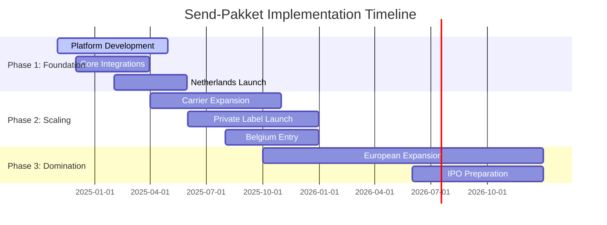

# 🚀 Implementation Roadmap - Send-Pakket
*Detailed 18-Month Execution Plan*

---

## 📅 Executive Timeline Overview



---

## 🎯 Phase 1: Foundation (Months 1-6)

### **🏗️ Month 1-2: Setup & Planning**

#### **Legal & Business Setup**
```
✅ Company Formation:
├── Netherlands B.V. registration
├── EU VAT registration (Netherlands, Belgium)
├── GDPR compliance documentation
├── Insurance (E&O, cyber liability)
└── Banking (business account, payment processing)

✅ Intellectual Property:
├── Trademark registration: "Send-Pakket"
├── Domain acquisition: send-pakket.com, .nl, .eu
├── Logo and brand identity design
├── Website placeholder with coming soon
└── Social media accounts setup
```

#### **Team Building**
```
👥 Core Team Hiring:
├── CTO (Full-stack architecture experience)
├── Lead Backend Developer (Node.js/Python)
├── Frontend Developer (React/Vue.js)
├── Product Manager (Logistics experience)
├── Business Development Manager
└── Customer Success Lead

📍 Office Setup:
├── Amsterdam headquarters (50m²)
├── Remote-first culture
├── Development tools and licenses
├── Project management setup (Jira/Notion)
└── Communication tools (Slack, Teams)
```

### **💻 Month 2-4: MVP Development**

#### **Backend Development**
```
🔧 Core Platform:
├── User authentication (OAuth 2.0)
├── Multi-tenant architecture
├── API gateway setup
├── Database schema design
├── Basic carrier integration framework
└── Order management system

🔌 Essential Integrations:
├── PostNL API (primary Dutch carrier)
├── DHL Express (international)
├── UPS (backup carrier)
├── Shopify integration
├── WooCommerce plugin
└── Basic email notifications
```

#### **Frontend Development**
```
🖥️ Web Application:
├── Dashboard for business users
├── Shipment creation flow
├── Tracking interface
├── Basic analytics
├── Account management
└── Mobile-responsive design

📱 Customer Portal:
├── Tracking page for end customers
├── Delivery preferences
├── Return initiation
├── Notification settings
└── Feedback system
```

### **🧪 Month 4-5: Testing & Optimization**

#### **Quality Assurance**
```
✅ Testing Strategy:
├── Unit tests (80%+ coverage)
├── Integration tests (API endpoints)
├── Load testing (1000 concurrent users)
├── Security penetration testing
├── GDPR compliance audit
└── Accessibility testing (WCAG 2.1)

🔍 Beta Testing:
├── Internal team testing (100 shipments)
├── 5 friendly businesses (500 shipments)
├── Feedback collection and iteration
├── Performance optimization
└── Bug fixes and refinements
```

### **🚀 Month 5-6: Launch Preparation**

#### **Go-to-Market Strategy**
```
📢 Marketing Preparation:
├── Website launch (full functionality)
├── SEO optimization
├── Content marketing strategy
├── Social media presence
├── PR strategy for launch
└── Partnership announcements

💰 Pricing Strategy:
├── Free tier (up to 50 shipments/month)
├── Starter plan (€29/month, 500 shipments)
├── Business plan (€99/month, 2000 shipments)
├── Enterprise (custom pricing)
└── Pay-per-use option (€0.35/shipment)
```

---

## 📈 Phase 2: Scaling (Months 7-12)

### **🌐 Month 7-8: Market Expansion**

#### **Carrier Network Growth**
```
🚛 Additional Carriers:
├── DPD (Europe-wide coverage)
├── GLS (regional strength)
├── Hermes (last-mile specialist)
├── FedEx (premium service)
├── TNT (business customers)
└── 20 regional carriers per country

🔗 E-commerce Platform Integrations:
├── Magento marketplace plugin
├── BigCommerce integration
├── Bol.com seller tools
├── Amazon FBA alternative
├── eBay shipping assistant
└── 15 additional platforms
```

#### **Belgium Market Entry**
```
🇧🇪 Belgium Expansion:
├── bpost integration (national carrier)
├── Belgian VAT registration
├── Flemish/French customer support
├── Local payment methods (Bancontact)
├── Belgian e-commerce partnerships
└── Brussels office setup (15m²)
```

### **🏷️ Month 8-10: Private Label Launch**

#### **First Collection Points Network**
```
📍 Initial 10 Collection Points:
├── Amsterdam: 3 locations (city center, south, north)
├── Rotterdam: 2 locations (center, port area)
├── The Hague: 2 locations (government district, residential)
├── Utrecht: 2 locations (station area, university)
├── Eindhoven: 1 location (tech district)
└── Partner types: convenience stores, postal points

🛠️ Operational Setup:
├── Collection point management app
├── Driver mobile app for pickup
├── Route optimization algorithm
├── Real-time tracking system
├── Customer notification system
└── Quality control processes
```

#### **Packaging Store Beta**
```
📦 Initial Product Range:
├── 25 standard box sizes
├── 10 bubble wrap options
├── 15 packaging tape varieties
├── Custom printing service (logos)
├── Eco-friendly options
└── Same-day delivery in Amsterdam

💻 E-commerce Store:
├── Online catalog and ordering
├── B2B bulk pricing
├── Custom packaging configurator
├── Inventory management system
└── Integration with main platform
```

### **📊 Month 10-12: Analytics & AI**

#### **Advanced Features Development**
```
🤖 AI-Powered Features:
├── Delivery time prediction (machine learning)
├── Route optimization algorithm
├── Dynamic pricing engine
├── Customer behavior analytics
├── Fraud detection system
└── Demand forecasting

📈 Enhanced Dashboard:
├── Real-time shipment tracking
├── Performance analytics
├── Cost optimization suggestions
├── Customer satisfaction metrics
├── Revenue reporting
└── API usage statistics
```

---

## 🏆 Phase 3: Domination (Year 2-3)

### **🌍 Month 13-18: European Expansion**

#### **Germany Market Entry**
```
🇩🇪 Germany Launch:
├── DHL partnership expansion
├── Hermes deep integration
├── German language support
├── Berlin office establishment
├── Local payment methods
└── DACH region strategy

🔗 Local Partnerships:
├── German e-commerce platforms
├── Local logistics companies
├── Technology integrations
├── Marketing partnerships
└── Chamber of commerce membership
```

#### **France & Italy Expansion**
```
🇫🇷 France Strategy:
├── La Poste integration
├── Chronopost partnership
├── French language support
├── Paris representative office
└── GDPR compliance updates

🇮🇹 Italy Strategy:
├── Poste Italiane integration
├── SDA Express partnership
├── Italian language support
├── Milan market research
└── Local carrier partnerships
```

### **🚀 Month 18-24: Advanced Features**

#### **Enterprise Solutions**
```
🏢 White-Label Platform:
├── Custom branding options
├── API-first architecture
├── Multi-tenant isolation
├── Custom domain support
├── Advanced analytics
└── Dedicated account management

🔧 Advanced Integrations:
├── ERP system connectors (SAP, Oracle)
├── Inventory management systems
├── Accounting software integrations
├── Customer support platforms
└── Business intelligence tools
```

#### **Technology Innovation**
```
🔬 Cutting-Edge Features:
├── Blockchain-based tracking
├── IoT sensor integration
├── Drone delivery pilots
├── Augmented reality packaging
├── Voice assistant integration
└── Carbon footprint tracking

📱 Mobile Apps:
├── Business owner app (iOS/Android)
├── Customer tracking app
├── Driver management app
├── Collection point partner app
└── Offline functionality
```

---

## 💰 Investment & Funding Strategy

### **Funding Rounds**

#### **Seed Round (Month 1)**
```
💰 Target: €500,000
├── 6 months operational runway
├── MVP development costs
├── Initial team salaries
├── Legal and compliance
├── Marketing launch budget
└── 15% equity dilution
```

#### **Series A (Month 8)**
```
💰 Target: €2,000,000
├── European expansion
├── Team scaling (20 employees)
├── Technology infrastructure
├── Private label network setup
├── Marketing and partnerships
└── 20% equity dilution
```

#### **Series B (Month 18)**
```
💰 Target: €8,000,000
├── Full European rollout
├── Advanced AI development
├── Enterprise solutions
├── Acquisition opportunities
├── IPO preparation
└── 15% equity dilution
```

---

## 📊 Key Performance Indicators (KPIs)

### **Month 6 Targets**
- **Active Customers**: 100 businesses
- **Monthly Shipments**: 2,000
- **Platform Uptime**: 99.5%
- **Customer Satisfaction**: 4.5/5
- **API Response Time**: <200ms

### **Month 12 Targets**
- **Active Customers**: 1,000 businesses
- **Monthly Shipments**: 25,000
- **Collection Points**: 50
- **Countries**: 2 (Netherlands, Belgium)
- **Revenue**: €200,000/month

### **Month 18 Targets**
- **Active Customers**: 5,000 businesses
- **Monthly Shipments**: 100,000
- **Collection Points**: 200
- **Countries**: 4 (+ Germany, France)
- **Revenue**: €800,000/month

### **Month 24 Targets**
- **Active Customers**: 15,000 businesses
- **Monthly Shipments**: 300,000
- **Collection Points**: 500
- **Countries**: 6 (+ Italy, Spain)
- **Revenue**: €2,000,000/month

---

## 🎯 Success Metrics & Milestones

### **Technical Milestones**
- ✅ **MVP Launch**: Month 6
- ✅ **100 API Integrations**: Month 12
- ✅ **1M API Calls/Day**: Month 18
- ✅ **99.95% Uptime**: Month 24

### **Business Milestones**
- ✅ **Break-Even**: Month 14
- ✅ **€1M ARR**: Month 16
- ✅ **€10M ARR**: Month 24
- ✅ **IPO Ready**: Month 30

**Ready to execute this roadmap and dominate the European shipping market! 🚀**