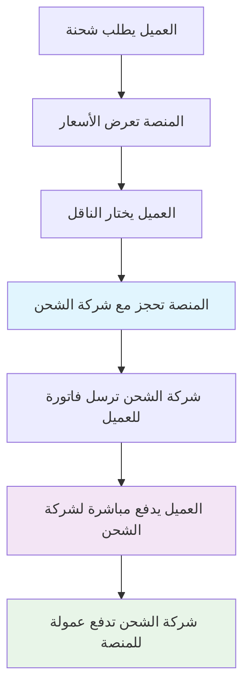
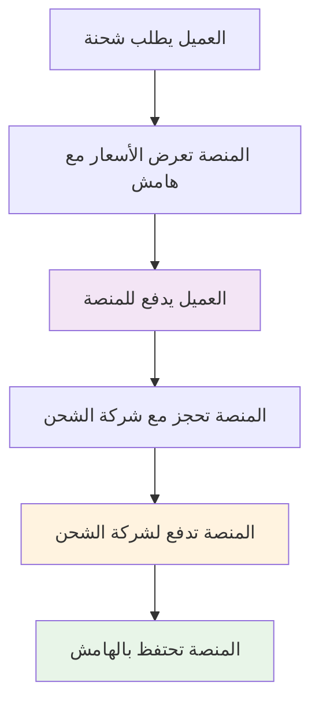

````markdown
# تكاملات أبواب الدفع وطرق الدفع في منصة الشحن
## Payment Gateway Integrations & Billing Models

---

## 🏦 نماذج الدفع الأساسية في المنصة

### **📋 نظرة عامة على السيناريوهات:**
```
🔄 السيناريو الأول: العقد مع المستخدم (Direct Billing)
├── العميل لديه حساب مباشر مع شركة الشحن
├── المنصة تسهل الحجز فقط
├── الدفع يتم مباشرة لشركة الشحن
└── المنصة تحصل على عمولة من شركة الشحن

🔄 السيناريو الثاني: العقد مع المنصة (Platform Billing)
├── المنصة لديها العقد الرئيسي مع شركة الشحن
├── العميل يدفع للمنصة
├── المنصة تدفع لشركة الشحن
└── المنصة تضع هامش ربحها
```

---

## 💳 السيناريو الأول: العقد مع المستخدم (Direct Billing)

### **🎯 كيف يعمل النموذج:**

#### **📊 تدفق العملية:**


#### **💰 آلية الدفع والفوترة:**
```
🏪 حساب العميل مع شركة الشحن:
├── العميل يفتح حساب مع DHL/UPS/DPD
├── شروط دفع مباشرة (Net 30 days مثلاً)
├── Credit limit محدد حسب حجم العميل
├── فواتير شهرية مباشرة من شركة الشحن
└── Customer number/account number للربط

💳 عملية الدفع:
├── العميل يشحن عبر منصتنا
├── شركة الشحن تسجل الشحنة على حساب العميل
├── فاتورة شهرية تُرسل للعميل مباشرة
├── العميل يدفع لشركة الشحن (Bank transfer/Credit card)
└── شركة الشحن تدفع عمولة للمنصة (2-5%)
```

#### **🔌 التكاملات التقنية المطلوبة:**

##### **1. تكامل Customer Account Linking:**
```json
// API Call لربط حساب العميل
{
  "customer_id": "CUST001",
  "carrier": "DHL",
  "account_details": {
    "account_number": "123456789",
    "customer_name": "ABC Company B.V.",
    "billing_address": {
      "street": "Hoofdstraat 123",
      "city": "Amsterdam", 
      "postal_code": "1000AA",
      "country": "NL"
    },
    "payment_terms": "NET_30",
    "credit_limit": 50000
  },
  "verification_method": "test_shipment"
}
```

##### **2. Billing Integration APIs:**
```json
// DHL Direct Billing API
{
  "endpoint": "https://api.dhl.com/shipping/v1/accounts",
  "authentication": "OAuth2",
  "billing_model": "direct",
  "commission_rate": 3.5,
  "settlement_period": "monthly"
}

// PostNL Business Account Integration
{
  "endpoint": "https://api.postnl.nl/business/v2/accounts", 
  "authentication": "API_Key",
  "billing_model": "monthly_invoice",
  "commission_rate": 2.8,
  "payment_terms": "NET_30"
}
```

##### **3. Commission Tracking System:**
```python
# Python code للتتبع العمولات
class CommissionTracker:
    def __init__(self):
        self.commissions = {}
    
    def track_shipment(self, shipment_id, carrier, amount):
        commission_rate = self.get_commission_rate(carrier)
        commission_amount = amount * commission_rate
        
        self.commissions[shipment_id] = {
            "carrier": carrier,
            "shipment_amount": amount,
            "commission_rate": commission_rate,
            "commission_amount": commission_amount,
            "status": "pending",
            "expected_payment_date": self.calculate_payment_date(carrier)
        }
    
    def get_commission_rate(self, carrier):
        rates = {
            "DHL": 0.035,  # 3.5%
            "PostNL": 0.028,  # 2.8%
            "DPD": 0.032,  # 3.2%
            "UPS": 0.04   # 4.0%
        }
        return rates.get(carrier, 0.03)
```

#### **🎯 مزايا هذا النموذج:**
```
✅ للمنصة:
├── لا حاجة لرؤوس أموال كبيرة
├── لا مخاطر ائتمانية
├── عمولة مضمونة من شركة الشحن
├── تركيز على التقنية والخدمة
└── سهولة في المحاسبة

✅ للعميل:
├── أسعار مباشرة من شركة الشحن (بدون هامش)
├── علاقة مباشرة مع شركة الشحن
├── شروط دفع مرنة (Net 30-60 days)
├── Credit limit أعلى
└── فواتير موحدة من شركة الشحن
```

#### **⚠️ التحديات:**
```
❌ للمنصة:
├── عمولة أقل (2-5% بدلاً من 20-30%)
├── اعتماد على شركة الشحن للدفع
├── صعوبة في تتبع العمولات
├── لا سيطرة على الأسعار
└── العميل قد يتعامل مباشرة مع شركة الشحن لاحقاً

❌ للعميل:
├── ضرورة فتح حسابات متعددة
├── Credit checks مطلوبة
├── حد أدنى للحجم أحياناً
├── عملية تفعيل أطول
└── فواتير متعددة من ناقلين مختلفين
```

---

## 🏛️ السيناريو الثاني: العقد مع المنصة (Platform Billing)

### **🎯 كيف يعمل النموذج:**

#### **📊 تدفق العملية:**


#### **💰 آلية الدفع والفوترة:**
```
🏪 حساب المنصة مع شركة الشحن:
├── المنصة لديها العقد الرئيسي
├── خصومات حجم كبيرة (20-40%)
├── Credit line ضخم (€1M+)
├── شروط دفع مفضلة (Net 45-60 days)
└── Master Account للجميع

💳 عملية الدفع:
├── العميل يدفع للمنصة فوراً (Credit card/PayPal/Bank)
├── المنصة تضع هامش ربح (15-30%)
├── المنصة تدفع لشركة الشحن حسب الاتفاق
├── المنصة تحتفظ بالفرق كربح
└── فاتورة واحدة موحدة للعميل
```

#### **🔌 أبواب الدفع المطلوبة للعملاء:**

##### **1. Credit Card Processing:**
```json
// Stripe Integration
{
  "provider": "Stripe",
  "supported_cards": ["Visa", "Mastercard", "Amex"],
  "currencies": ["EUR", "USD", "GBP"],
  "features": [
    "3D Secure",
    "Instant payment",
    "Recurring billing",
    "Multi-currency",
    "Mobile payments"
  ],
  "fees": {
    "eu_cards": "1.4% + €0.25",
    "non_eu_cards": "2.9% + €0.25"
  }
}

// Adyen Integration (European focused)
{
  "provider": "Adyen", 
  "supported_methods": [
    "Credit/Debit Cards",
    "SEPA Direct Debit",
    "iDEAL (Netherlands)",
    "Bancontact (Belgium)",
    "SOFORT (Germany)",
    "PayPal",
    "Apple Pay",
    "Google Pay"
  ],
  "currencies": ["EUR", "USD", "GBP", "CHF"],
  "fees": "Interchange + 0.60€"
}
```

##### **2. Local Payment Methods (European):**
```json
// Netherlands - iDEAL
{
  "method": "iDEAL",
  "usage": "70% of online payments in Netherlands",
  "banks": ["ING", "Rabobank", "ABN AMRO", "SNS Bank"],
  "process_time": "Instant",
  "fees": "€0.35 per transaction"
}

// Germany - SOFORT
{
  "method": "SOFORT",
  "usage": "40% of German e-commerce",
  "process_time": "Instant",
  "fees": "1.4% + €0.25"
}

// Belgium - Bancontact
{
  "method": "Bancontact", 
  "usage": "60% of Belgian online payments",
  "process_time": "Instant",
  "fees": "€0.31 per transaction"
}

// Europe-wide - SEPA Direct Debit
{
  "method": "SEPA_DD",
  "usage": "Recurring payments",
  "process_time": "1-2 business days",
  "fees": "€0.25 per transaction"
}
```

##### **3. Business Payment Solutions:**
```json
// Bank Transfer/Wire
{
  "method": "SEPA_Transfer",
  "usage": "Large B2B transactions",
  "process_time": "1-2 business days",
  "fees": "€0-5 depending on bank",
  "benefits": ["No transaction limits", "Lower fees for large amounts"]
}

// Invoice/Net Terms
{
  "method": "Invoice_Payment",
  "credit_check": "Required for Net 30+",
  "credit_limits": "€1,000 - €100,000",
  "payment_terms": ["Net 7", "Net 15", "Net 30"],
  "late_fees": "1.5% per month"
}
```

#### **🔌 التكاملات مع شركات الشحن:**

##### **1. Volume Contract Integration:**
```json
// DHL Volume Contract API
{
  "endpoint": "https://api.dhl.com/shipping/v1/volume-contracts",
  "contract_type": "Master Agreement",
  "volume_commitment": "50000_shipments_annually",
  "discount_tiers": {
    "0-1000": "15%",
    "1001-5000": "25%", 
    "5001-20000": "35%",
    "20000+": "40%"
  },
  "payment_terms": "NET_45",
  "credit_limit": 1000000
}
```

##### **2. Automated Billing Integration:**
```python
# Automated billing system
class PlatformBilling:
    def __init__(self):
        self.carrier_accounts = {}
        self.customer_payments = {}
    
    def process_shipment_payment(self, shipment):
        # 1. Charge customer immediately
        customer_charge = shipment.cost * (1 + self.markup_rate)
        payment_result = self.charge_customer(
            customer_id=shipment.customer_id,
            amount=customer_charge,
            currency="EUR"
        )
        
        if payment_result.success:
            # 2. Record liability to carrier
            self.record_carrier_liability(
                carrier=shipment.carrier,
                amount=shipment.cost,
                due_date=self.calculate_due_date(shipment.carrier)
            )
            
            # 3. Record profit
            profit = customer_charge - shipment.cost
            self.record_profit(shipment.id, profit)
            
        return payment_result
    
    def settle_with_carriers_monthly(self):
        # Monthly settlement with carriers
        for carrier, liability in self.carrier_liabilities.items():
            payment_amount = sum(liability.amounts)
            self.pay_carrier(carrier, payment_amount)
```

##### **3. Cash Flow Management:**
```python
class CashFlowManager:
    def __init__(self):
        self.float_requirements = {}
    
    def calculate_float_needed(self):
        # حساب رأس المال المطلوب للتشغيل
        monthly_volume = self.get_monthly_shipment_volume()
        average_shipment_cost = self.get_average_cost()
        payment_delay_days = 45  # متوسط فترة الدفع للناقلين
        
        float_needed = (monthly_volume * average_shipment_cost * 
                       payment_delay_days / 30)
        
        return float_needed
    
    def manage_credit_lines(self):
        # إدارة خطوط الائتمان مع البنوك
        total_exposure = self.calculate_total_carrier_exposure()
        available_credit = self.get_available_credit_lines()
        
        if total_exposure > available_credit * 0.8:
            self.request_credit_increase()
```

#### **🎯 مزايا هذا النموذج:**
```
✅ للمنصة:
├── هامش ربح أعلى (15-30%)
├── سيطرة كاملة على الأسعار
├── علاقة مباشرة مع العميل
├── بيانات مالية شاملة
├── إمكانية خدمات إضافية (تأمين، تمويل)
└── Cash flow إيجابي (العميل يدفع فوراً)

✅ للعميل:
├── حساب واحد لجميع الناقلين
├── فاتورة موحدة
├── لا حاجة لحسابات متعددة
├── خدمة عملاء موحدة
├── مقارنة أسعار شفافة
└── بداية فورية بدون Credit checks
```

#### **⚠️ التحديات:**
```
❌ للمنصة:
├── حاجة لرأس مال كبير (€500K-2M)
├── مخاطر ائتمانية مع العملاء
├── Credit risk مع شركات الشحن
├── تعقيد في إدارة التدفق النقدي
├── مسؤولية كاملة عن خدمة العملاء
└── مخاطر تقلبات أسعار الصرف

❌ للعميل:
├── أسعار أعلى (بسبب هامش المنصة)
├── دفع فوري مطلوب
├── أقل مرونة في شروط الدفع
└── اعتماد كامل على المنصة
```

---

## 🔄 النموذج الهجين (Hybrid Model) - الأفضل للبداية

### **🎯 الاستراتيجية المثلى:**

#### **📊 توزيع العملاء:**
```
🏢 العملاء الكبار (50+ شحنة/شهر):
├── النموذج: Direct Billing
├── المزايا: أسعار أفضل، شروط مرنة
├── المتطلبات: Credit check، حد أدنى للحجم
└── العمولة: 2-5%

🏪 العملاء الصغار/المتوسطين (<50 شحنة/شهر):
├── النموذج: Platform Billing  
├── المزايا: بداية سريعة، خدمة شاملة
├── المتطلبات: دفع فوري فقط
└── الهامش: 15-25%
```

#### **🔄 نظام التدرج التلقائي:**
```python
class CustomerTierManager:
    def evaluate_customer_tier(self, customer_id):
        monthly_volume = self.get_monthly_volume(customer_id)
        payment_history = self.get_payment_reliability(customer_id)
        
        if monthly_volume >= 50 and payment_history.score >= 8:
            return "ENTERPRISE"  # Direct billing eligible
        elif monthly_volume >= 10:
            return "BUSINESS"    # Hybrid options
        else:
            return "STARTER"     # Platform billing only
    
    def auto_upgrade_customer(self, customer_id):
        current_tier = self.get_customer_tier(customer_id)
        eligible_tier = self.evaluate_customer_tier(customer_id)
        
        if eligible_tier != current_tier:
            self.send_upgrade_offer(customer_id, eligible_tier)
```

---

## 💻 تطبيق عملي للتكاملات

### **🔧 Payment Gateway Integration Architecture:**

#### **1. Unified Payment API:**
```javascript
// Frontend payment integration
class PaymentProcessor {
    constructor() {
        this.gateways = {
            'stripe': new StripeGateway(),
            'adyen': new AdyenGateway(),
            'paypal': new PayPalGateway()
        };
    }
    
    async processPayment(shipmentData, paymentMethod) {
        const cost = await this.calculateTotalCost(shipmentData);
        const gateway = this.selectOptimalGateway(paymentMethod, cost);
        
        try {
            const result = await gateway.charge({
                amount: cost.total,
                currency: cost.currency,
                description: `Shipping: ${shipmentData.tracking_number}`,
                metadata: {
                    customer_id: shipmentData.customer_id,
                    carrier: shipmentData.carrier,
                    service_type: shipmentData.service_type
                }
            });
            
            if (result.success) {
                await this.confirmShipmentBooking(shipmentData);
                await this.recordPayment(result);
            }
            
            return result;
        } catch (error) {
            await this.handlePaymentFailure(shipmentData, error);
            throw error;
        }
    }
    
    selectOptimalGateway(paymentMethod, cost) {
        // Logic to select best gateway based on:
        // - Payment method type
        // - Transaction amount  
        // - Customer location
        // - Fees optimization
        
        if (paymentMethod === 'ideal') return this.gateways.adyen;
        if (cost.amount > 1000) return this.gateways.stripe;
        return this.gateways.adyen; // Default for Europe
    }
}
```

#### **2. Carrier Payment Integration:**
```python
# Backend carrier payment system
class CarrierPaymentManager:
    def __init__(self):
        self.carrier_apis = {
            'dhl': DHLBillingAPI(),
            'postnl': PostNLBillingAPI(), 
            'dpd': DPDBillingAPI()
        }
    
    async def process_carrier_billing(self, shipment):
        carrier = shipment.carrier.lower()
        billing_api = self.carrier_apis[carrier]
        
        if shipment.billing_model == 'direct':
            # Direct billing to customer
            result = await billing_api.charge_to_customer_account(
                customer_account=shipment.customer_carrier_account,
                shipment_details=shipment.to_dict(),
                our_commission_rate=self.get_commission_rate(carrier)
            )
        else:
            # Platform billing
            result = await billing_api.charge_to_platform_account(
                shipment_details=shipment.to_dict(),
                payment_terms=self.get_payment_terms(carrier)
            )
        
        await self.record_billing_transaction(shipment.id, result)
        return result
```

---

## 📊 المقارنة المالية بين النموذجين

### **💰 مثال عملي - شحنة €20:**

#### **🔄 Direct Billing Model:**
```
شحنة بقيمة €20:
├── العميل يدفع: €20 (لشركة الشحن مباشرة)
├── عمولة المنصة: €0.70 (3.5%)
├── ربح المنصة: €0.70
└── هامش الربح: 3.5%

لـ 1000 شحنة شهرياً:
├── إجمالي قيمة الشحنات: €20,000
├── ربح المنصة: €700
├── رأس المال المطلوب: €0 (لا توجد مخاطر ائتمانية)
└── ROI: ∞ (لا استثمار مبدئي)
```

#### **🏛️ Platform Billing Model:**
```
شحنة بقيمة €20 (تكلفة حقيقية):
├── العميل يدفع: €25 (25% markup)
├── المنصة تدفع لشركة الشحن: €20
├── ربح المنصة: €5
└── هامش الربح: 25%

لـ 1000 شحنة شهرياً:
├── إجمالي إيرادات: €25,000
├── تكلفة الناقلين: €20,000
├── ربح المنصة: €5,000
├── رأس المال المطلوب: €60,000 (3 أشهر float)
└── ROI: 100% سنوياً
```

### **🎯 التوصية الاستراتيجية:**

```
🚀 البداية (السنة الأولى):
├── 80% Platform Billing (العملاء الصغار)
├── 20% Direct Billing (العملاء الكبار)
├── التركيز على نمو سريع وtraction
└── بناء ثقة مع شركات الشحن

📈 التوسع (السنة الثانية-الثالثة):
├── 60% Platform Billing  
├── 40% Direct Billing
├── تطوير خدمات إضافية (تأمين، تمويل)
└── تحسين الهوامش والكفاءة

🏆 النضج (السنة الرابعة+):
├── 40% Platform Billing
├── 60% Direct Billing  
├── خدمات logistics شاملة
└── IPO أو exit strategy
```

**النتيجة: نموذج هجين يحقق نمو سريع مع ربحية مستدامة! 🚀**
````