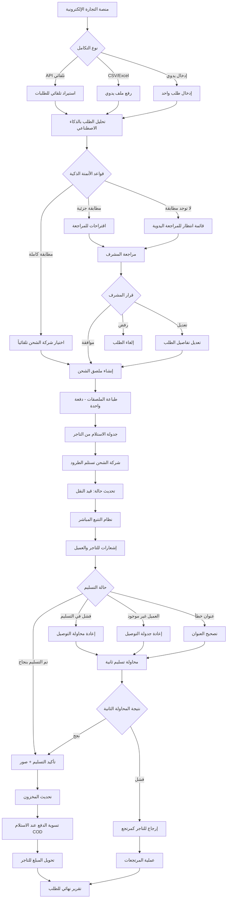
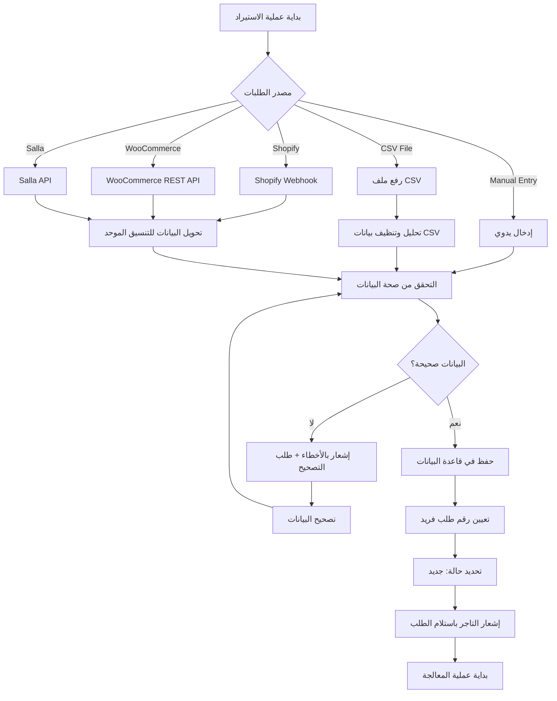
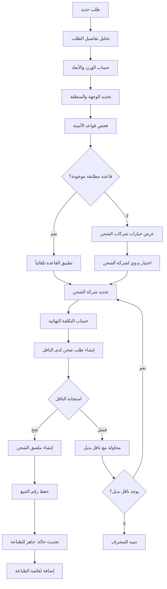
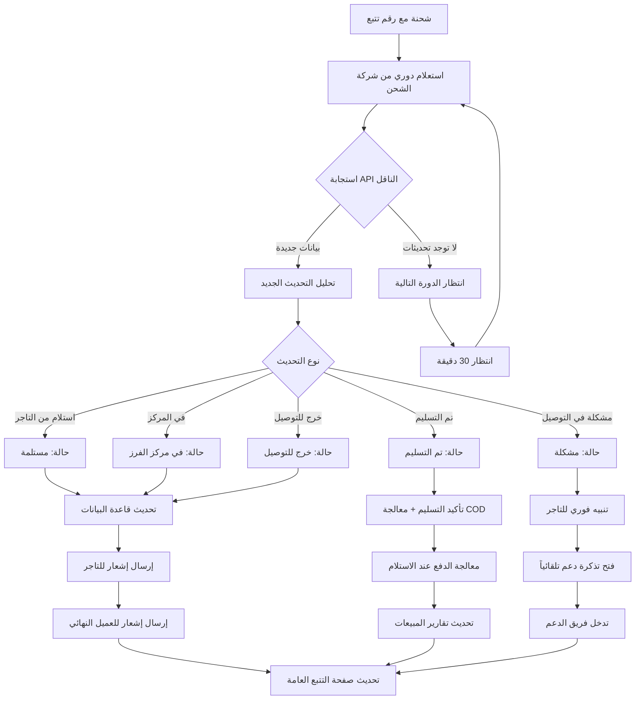
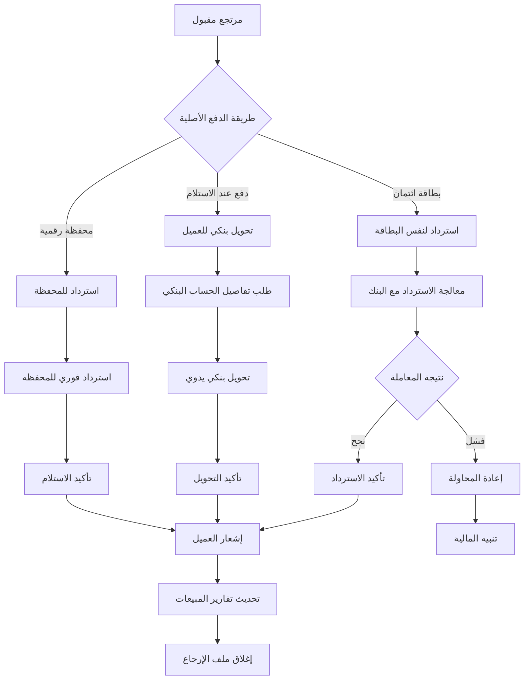
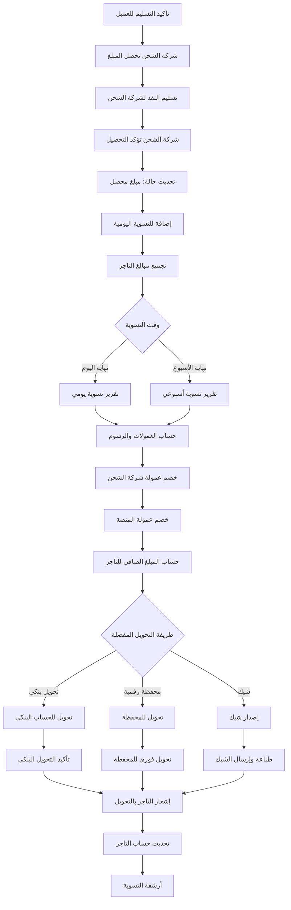
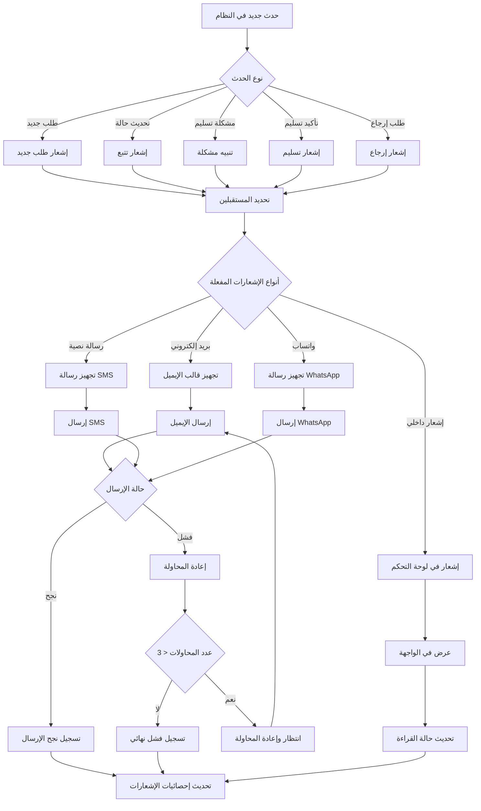
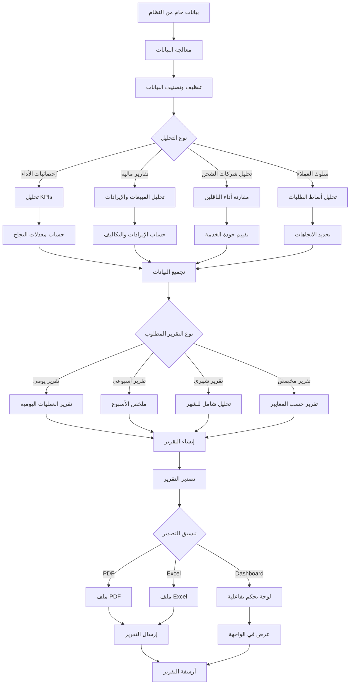
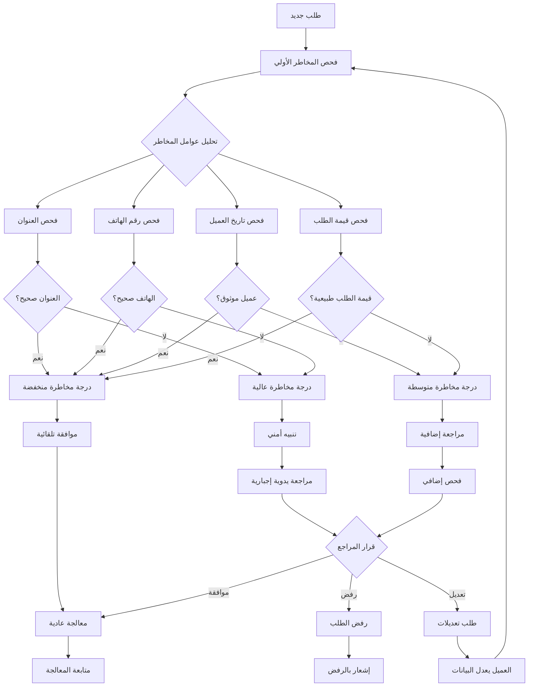

````markdown
# مخططات تدفق العمل - منصة الشحن الاحترافية
## Workflow Diagrams & Process Flows

---

## 1. المخطط الرئيسي لسير العمل (Main Workflow)



---

## 2. تدفق إدارة الطلبات (Order Management Flow)

### 2.1 استيراد الطلبات (Order Import)



### 2.2 معالجة الطلبات (Order Processing)



---

## 3. تدفق نظام التتبع (Tracking System Flow)



---

## 4. تدفق إدارة المرتجعات (Returns Management Flow)

### 4.1 طلب الإرجاع (Return Request)

```mermaid
graph TD
    A[العميل يريد إرجاع منتج] --> B[فتح بوابة الإرجاع]
    B --> C[إدخال رقم الطلب/الشحنة]
    C --> D{التحقق من صحة البيانات}
    D -->|غير صحيح| E[رسالة خطأ + محاولة مرة أخرى]
    D -->|صحيح| F[عرض تفاصيل الطلب]
    
    E --> C
    F --> G[اختيار المنتجات للإرجاع]
    G --> H[اختيار سبب الإرجاع]
    H --> I[رفع صور المنتج (اختياري)]
    I --> J[تأكيد طلب الإرجاع]
    
    J --> K[إرسال طلب للتاجر]
    K --> L{قرار التاجر}
    L -->|موافقة| M[إنشاء ملصق إرجاع]
    L -->|رفض| N[إشعار العميل بالرفض]
    L -->|طلب معلومات إضافية| O[طلب توضيحات]
    
    M --> P[إرسال ملصق الإرجاع للعميل]
    O --> Q[العميل يقدم توضيحات]
    Q --> L
    
    P --> R[العميل يطبع الملصق]
    R --> S[العميل يسلم الطرد لشركة الشحن]
    S --> T[تتبع شحنة الإرجاع]
    
    T --> U{وصول المرتجع للتاجر}
    U -->|وصل| V[فحص المنتج المرتجع]
    U -->|لم يصل| W[متابعة مع شركة الشحن]
    
    V --> X{حالة المنتج}
    X -->|مقبول| Y[معالجة الاسترداد]
    X -->|غير مقبول| Z[رفض الاسترداد]
    
    Y --> AA[استرداد المبلغ]
    Z --> BB[إشعار العميل بالرفض]
    AA --> CC[تحديث المخزون]
    CC --> DD[إشعار العميل بالاسترداد]
```

### 4.2 معالجة الاسترداد (Refund Processing)



---

## 5. تدفق إدارة الدفع عند الاستلام (COD Management Flow)



---

## 6. تدفق نظام الإشعارات (Notification System Flow)



---

## 7. تدفق التحليلات والتقارير (Analytics & Reports Flow)



---

## 8. تدفق إدارة المخاطر (Risk Management Flow)



---

## الخلاصة

هذه المخططات توضح التدفقات الأساسية للمنصة، وتعطي فهماً واضحاً لكيفية عمل كل جزء من النظام. يمكن استخدام هذه المخططات مع شركة التطوير لضمان تنفيذ سير العمل بالطريقة الصحيحة.

كل مخطط يركز على جانب معين من النظام، ويمكن تطويرها وتفصيلها أكثر حسب متطلبات التطوير والتنفيذ.
````